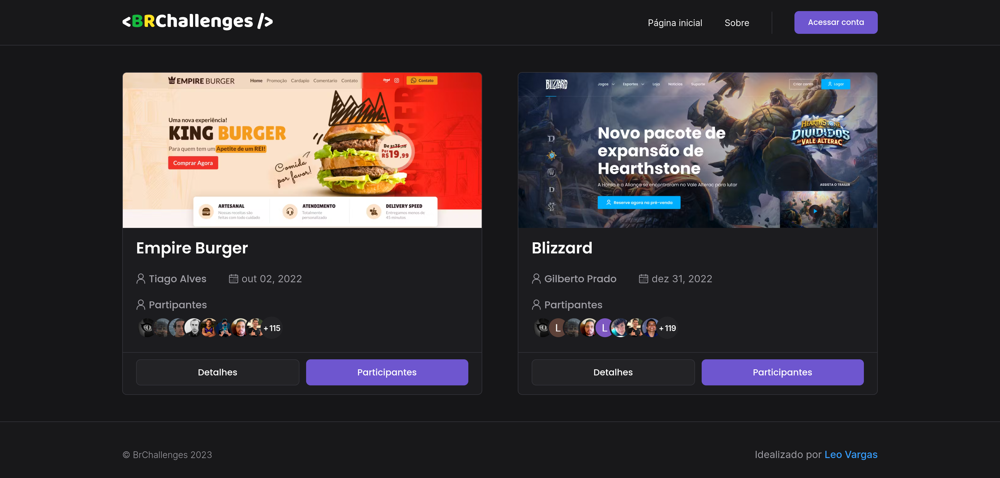

<p align="center">
  
</p>

<p align="center">
  
  
  
  
  

  <a href="https://github.com/leovargasdev/br-challenges/commits/master">
    
  </a>
  
  <a href="https://github.com/leovargasdev/br-challenges/issues">
    
  </a>
</p>



## 💻 Projeto

Plataforma de desafios frontend, quadro do notion com as tarefas [AQUI](https://leovargas.notion.site/741c30d90cc942f7aeff6f0af1699e7e?v=d81f9faa01b843929c01872ab2be6aee)

-  [Next.js](https://nextjs.org/)
-  [Sass](https://sass-lang.com/)
-  [TypeScript](https://www.typescriptlang.org/)
-  [Mongoose](https://mongoosejs.com/)
-  [Prismic](https://prismic.io/)
-  [Next Auth](https://next-auth.js.org/)

Também foi adicionado as ferramentas [**ESLint**](https://eslint.org/) e [**Prettier**](https://prettier.io/) para aumentar a produtividade e auxiliar a manter um padrão de código.

## 📥 Instalação e execução

Faça um clone desse repositório e acesse o diretório.

```bash
# Instalando as dependências
$ yarn

# Executanto aplicação
$ yarn next
```

**PS: Configurar as variáveis ambientes do arquivo `env.example`.**
